# 🌤️ Weather App — Nhóm Quang_Tú_Long
### Trường Đại học Phenikaa | Khoa Công nghệ Thông tin | Môn: Lập Trình Di Động

---

## 👥 Thành viên nhóm

| STT | Họ và Tên | MSSV | Màn hình phụ trách | Vai trò |
|-----|-----------|------|-------------------|---------|
| 1 | Dương Ngọc Tú | 22010052 | About / More Screen | Git Manager, Docs |
| 2 | Ngô Thành Long | 23010032 | Home Screen | Developer |
| 3 | Lê Minh Quang | 21012086 | Forecast Screen | Developer |

---

## 🔗 Links quan trọng

| Mục | Link |
|-----|------|
| 📁 **Git Repository** | https://github.com/DNTt30/weatherApp_Quang_Tu_Long_1_2026 |
| 🎨 **Figma Wireframe & Mockup** | [Figma Project Link](https://www.figma.com/design/tELT47KXj2t06pwxtkQoJw/Untitled?node-id=0-1&p=f&t=ayDaeKRBLNb1yvRz-0) |
| 🎬 **Demo YouTube** | *(Cập nhật sau khi quay video)* |

---

## 📱 Giới thiệu dự án

**Weather App** là ứng dụng xem thời tiết được xây dựng bằng **Flutter** kết hợp **Firebase**, thuộc dự án học kỳ môn Lập Trình Di Động — Đại học Phenikaa.

### Tính năng chính:
- 🔐 **Đăng ký / Đăng nhập** bằng Firebase Authentication
- 🏙️ **Xem thời tiết** 5 thành phố Việt Nam (Hà Nội, Đà Nẵng, HCM, Hải Phòng, Cần Thơ)
- 📊 **Dự báo 5 ngày** với biểu đồ xác suất mưa
- 🗃️ **So sánh thành phố** bằng bảng dữ liệu
- 📈 **Thống kê** nhiệt độ TB, độ ẩm, số ngày mưa
- ☁️ **Kết nối Firestore** — lưu thêm thành phố vào NoSQL
- 👤 **About screen** giới thiệu nhóm & thành viên

---

## 🛠️ Công nghệ sử dụng

| Thành phần | Công nghệ | Phiên bản |
|-----------|-----------|----------|
| Framework | Flutter | SDK ^3.11.3 |
| Language | Dart | - |
| Authentication | Firebase Auth | ^6.5.1 |
| Database | Cloud Firestore | ^6.4.1 |
| Core | Firebase Core | ^4.9.0 |
| Font | Google Fonts | ^6.2.1 |
| Icons | Material Icons | built-in |

---

## 📂 Cấu trúc dự án

```
lib/
├── main.dart                   # App entry point, MainShell, routing
├── firebase_options.dart        # Firebase configuration
│
├── models/
│   ├── weather.dart             # Class Weather (city, temp, status, humidity, isRaining)
│   ├── forecast.dart            # Class Forecast (id, dateTime, min/maxTemp, rainProbability)
│   ├── city.dart                # Class City (id, name)
│   └── search_history.dart      # Class SearchHistory
│
├── screens/
│   ├── login_screen.dart        # Đăng nhập (US-02)
│   ├── register_screen.dart     # Đăng ký (US-01)
│   ├── home_screen.dart         # Thời tiết hiện tại (US-03,04,05,06,09) — Long
│   ├── discover_screen.dart     # Khám phá thời tiết địa điểm du lịch (US-12)
│   ├── content_screen.dart      # Dự báo chi tiết (US-07,08) — Quang
│   └── about_screen.dart        # Giới thiệu nhóm (US-10) — Tú
│
├── service/
│   ├── auth_service.dart        # Firebase Auth wrapper (signIn, signUp, signOut)
│   ├── firestore_service.dart   # Firestore CRUD (addCity, favorite)
│   ├── api_service.dart         # Open-Meteo API wrapper
│   ├── settings_service.dart    # Quản lý cài đặt (đơn vị nhiệt độ, dark/light mode)
│   └── weather_data_manager.dart# Quản lý state tập trung cho toàn app
│
└── widgets/
    ├── bottom_nav_bar.dart      # Bottom Navigation Bar (4 tab)
    ├── app_drawer.dart          # Side Drawer
    ├── shared_widgets.dart      # GroupPhotoHeader, MemberInfoFooter, AppConstants
    ├── city_card.dart           # Thẻ hiển thị thành phố
    ├── custom_bottom_bar.dart   # Thanh bottom tùy chỉnh (nếu dùng)
    ├── hourly_forecast_card.dart# Thẻ hiển thị thời tiết theo giờ
    └── list_city.dart           # Danh sách các thành phố

test/
├── widget_test.dart             # 25 Unit Tests (Model + Business Logic + Widget)
└── api_service_test.dart        # 4 Unit Tests (Autocomplete, NFD/NFC Normalization, Ranking, Deduplication)
```

---

## 🏗️ Kiến trúc & Thiết kế UML

### 1. Sơ đồ lớp (Class Diagram)

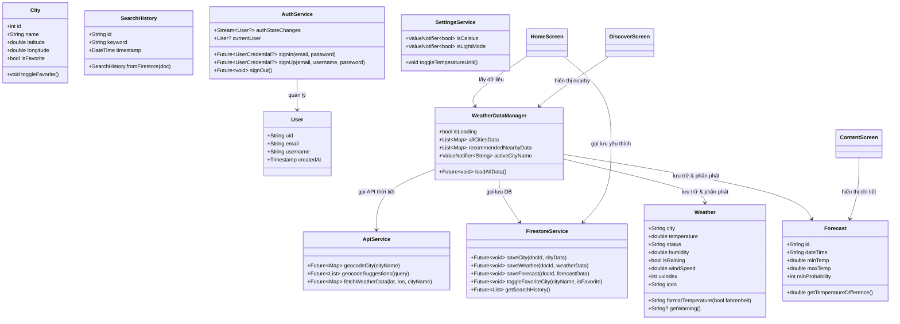

### 2. Sơ đồ tuần tự (Sequence Diagrams)

#### 2.1 Luồng Đăng Nhập (Login Flow)
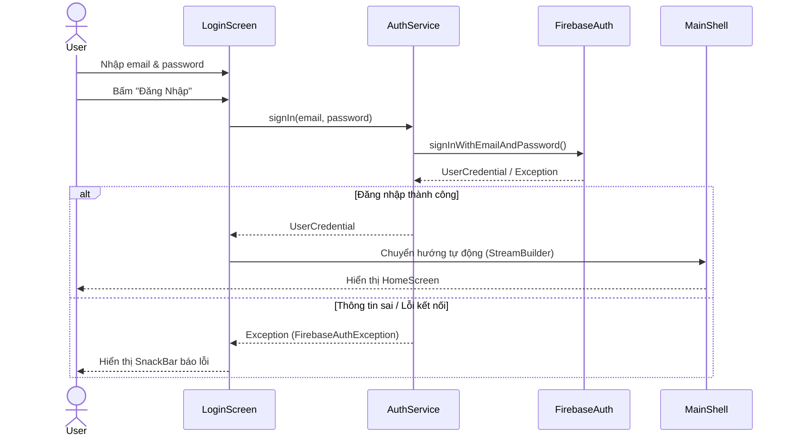

#### 2.2 Luồng Đăng Ký (Register Flow)
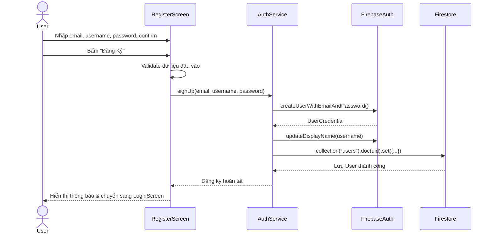

#### 2.3 Luồng Đổi Đơn Vị Nhiệt Độ (Celsius <-> Fahrenheit)
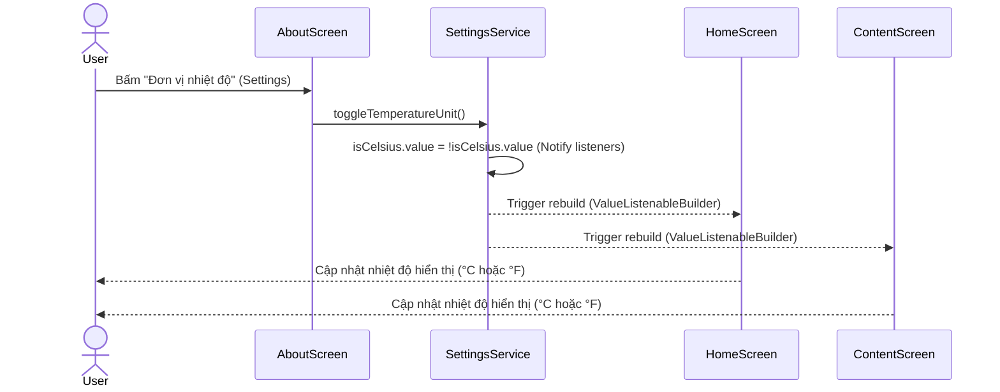

#### 2.4 Luồng Đồng Bộ Yêu Thích lên Firestore NoSQL
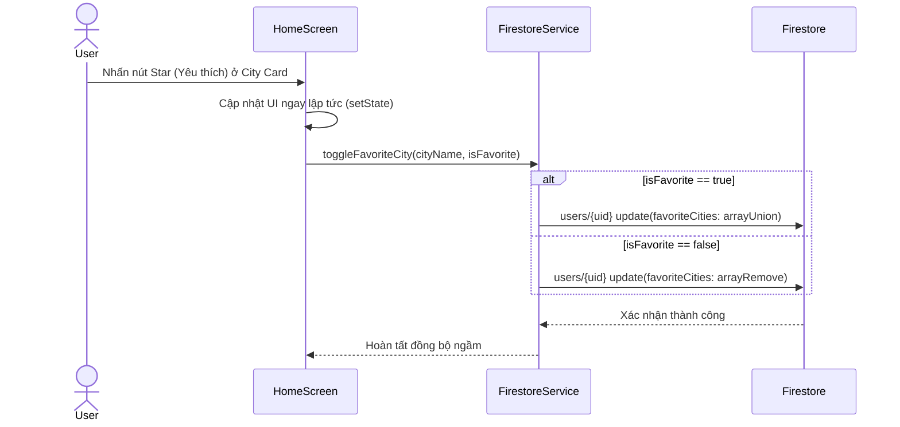

#### 2.5 Luồng Fetch Dữ Liệu Thời Tiết Toàn Cục (API & Cache)
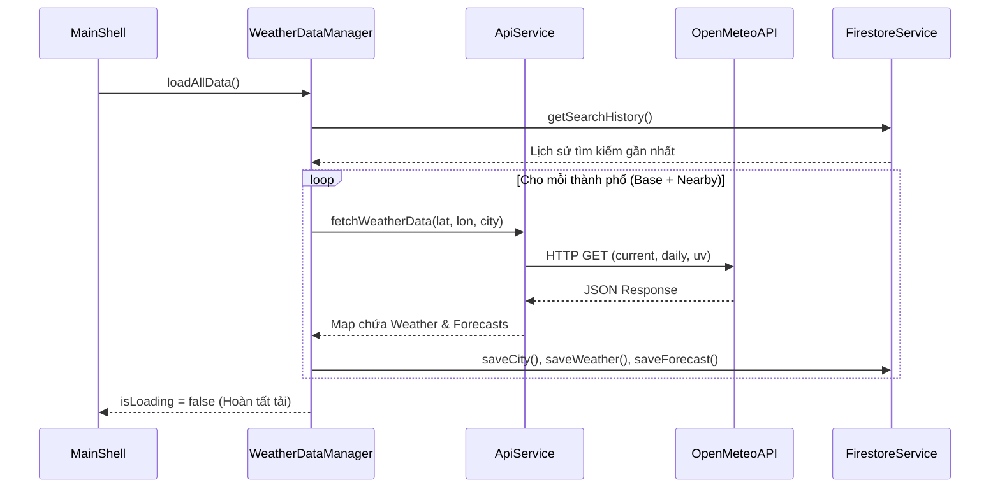

### 3. Sơ đồ hoạt động (Activity Diagrams)

#### 3.1 Luồng Khởi Động App & Kiểm Tra Trạng Thái Đăng Nhập
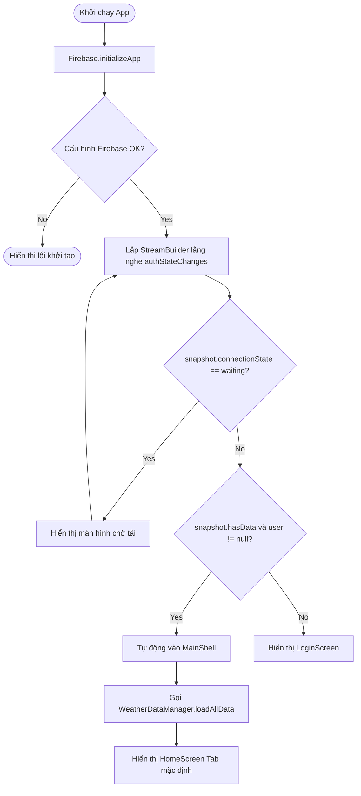

#### 3.2 Luồng Kiểm Tra và Cảnh Báo Điều Kiện Thời Tiết Xấu
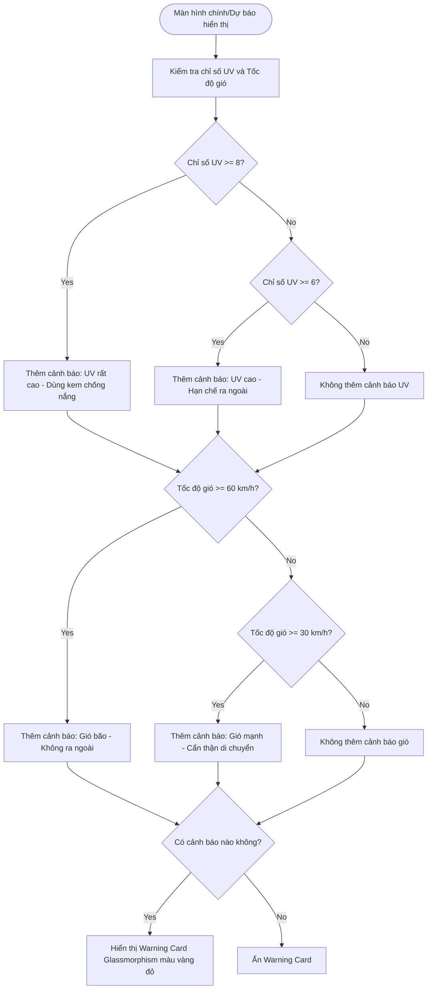

### 4. Thiết kế Database Firestore (NoSQL)

```
Firestore (NoSQL Database):
├── users/ (Collection)
│   └── {uid}:
│       ├── uid, email, username, createdAt
│       ├── favoriteCities: Array<String>
│       ├── temperatureUnit: String
│       ├── darkMode: Boolean
│       └── history/ (Sub-collection)
│           └── {auto-id}:
│               ├── cityName, lat, lon
│               └── timestamp
├── cities/ (Collection)
│   └── {cityName}:
│       ├── name, country, latitude, longitude
│       └── updatedAt
├── weather/ (Collection)
│   └── {cityName}:
│       ├── temperature, status, humidity, windSpeed, uvIndex, icon, isRaining
│       └── updatedAt
├── forecasts/ (Collection)
│   └── {cityName}:
│       ├── data: Array<Map>
│       └── updatedAt
└── feedbacks/ (Collection)
    └── {auto-id}:
        └── userId, userEmail, username, message, rating, timestamp
```

### 5. Ma trận các thao tác CRUD với Firebase/Firestore

| Thực thể (Collection) | Thao tác | Mô tả chi tiết trong dự án | Hàm xử lý & Vị trí code |
|-----------------------|----------|----------------------------|------------------------|
| **Tài khoản (users)** | **[C]reate** | Đăng ký tài khoản mới và lưu thông tin người dùng | `signUp()` trong auth_service.dart |
| | **[R]ead** | Lắng nghe trạng thái đăng nhập để tự động chuyển màn hình | `StreamBuilder` trong main.dart |
| **Thành phố (cities)** | **[C]reate** | Thêm thành phố giả lập mới vào Firestore | `addCity()` trong firestore_service.dart |
| | **[R]ead** | Truy vấn danh sách các thành phố đã thêm trên Cloud | `getCitiesStream()` trong firestore_service.dart |
| | **[U]pdate** | Cập nhật thời tiết/thông tin của thành phố | `updateCity()` trong firestore_service.dart |
| | **[D]elete** | Xóa thành phố khỏi danh sách quản lý | `deleteCity()` trong firestore_service.dart |
| **Yêu thích (favorites)**| **[C]reate** | Thả tim để lưu trạng thái yêu thích thành phố | `toggleFavoriteCity(..., true)` trong firestore_service.dart |
| | **[R]ead** | Tự động đồng bộ trạng thái sao vàng yêu thích khi mở app | `getFavoriteCities()` trong firestore_service.dart |
| | **[D]elete** | Bỏ thả tim để hủy trạng thái yêu thích trên Cloud | `toggleFavoriteCity(..., false)` trong firestore_service.dart |

---

## 🚀 Hướng dẫn cài đặt & chạy

### Yêu cầu hệ thống
- Flutter SDK >= 3.11.3
- Dart >= 3.0
- Android Studio / VS Code
- Firebase project đã cấu hình

### Bước 1: Clone repository
```bash
git clone https://github.com/DNTt30/weatherApp_Quang_Tu_Long_1_2026.git
cd weatherApp_Quang_Tu_Long_1_2026
```

### Bước 2: Cài đặt dependencies
```bash
flutter pub get
```

### Bước 3: Chạy ứng dụng
```bash
flutter run
```

### Bước 4: Chạy unit tests
```bash
flutter test
```

### Bước 5: Build & Deploy lên Firebase Hosting (Tối ưu 60 FPS)

Ứng dụng Flutter Web có thể được deploy rất nhanh chóng để giảng viên truy cập trực tiếp:

1. **Build bản phát hành Web:**
   ```bash
   flutter build web --release --web-renderer canvaskit
   ```
   *(Tham số `--web-renderer canvaskit` giúp ứng dụng vẽ giao diện bằng GPU, giữ vững hiệu suất **60 FPS** mượt mà trên mọi thiết bị)*.

2. **Cấu hình và Deploy qua Firebase Tools:**
   ```bash
   npm install -g firebase-tools
   firebase login
   firebase init hosting
   # - Thư mục chứa web: build/web
   # - Cấu hình Single Page App (SPA): Yes
   # - Ghi đè index.html: No
   
   firebase deploy --only hosting
   ```

---

## 🧪 Unit Tests (29 Test Cases)

| Nhóm | Số test | Mô tả |
|------|---------|-------|
| Weather Model | 5 | Khởi tạo, getWeatherInfo(), edge cases |
| Forecast Model | 6 | Khởi tạo, getTemperatureDifference(), getForecast() |
| City Model | 3 | Khởi tạo, danh sách, edge case |
| Business Logic | 6 | Phân loại thời tiết, tính toán thống kê |
| Widget Tests | 5 | LoginScreen, WeatherCard, BottomNav, AppBar |
| ApiService Autocomplete | 4 | Gợi ý tự động, chuẩn hóa NFC/NFD, sắp xếp rank, lọc trùng |
| **Tổng** | **29** | |

---

## 🎨 Thiết kế UI (Dynamic Light & Dark Glassmorphism)

Ứng dụng kết hợp linh hoạt giữa hai phong cách **Sáng (Light)** và **Tối (Dark)**, đi kèm hiệu ứng **Glassmorphism** đặc trưng:
- **Giao diện Đăng Nhập (Dark Mode):** Sử dụng tông màu tím tối (Deep Purple) sang trọng, mang lại ấn tượng thị giác cực mạnh theo phong cách Apple Weather.
- **Giao diện Trong App (Light/Dark Mode):** Hỗ trợ chuyển đổi linh hoạt. Chế độ sáng mang lại sự tươi mới, trong trẻo với các tông màu Pastel thân thiện (Home, Discover, Forecast, More).

### 📸 Hình ảnh giao diện thực tế (Screenshots)

<p align="center">
  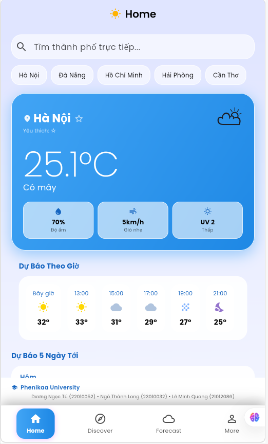
  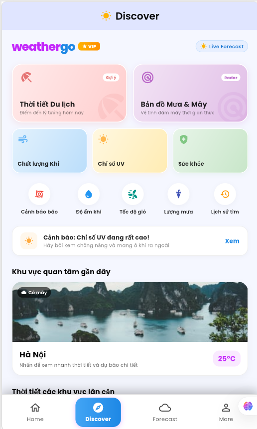
  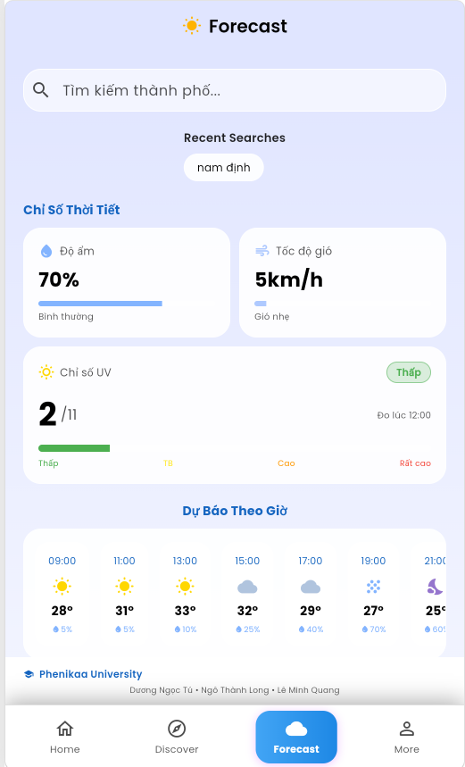
  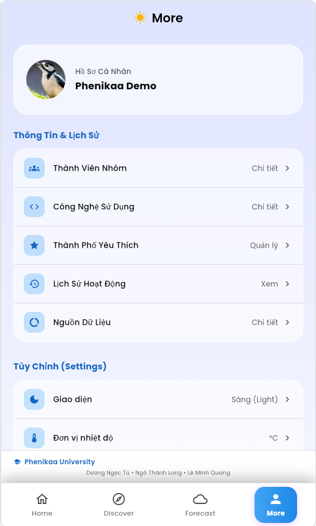
  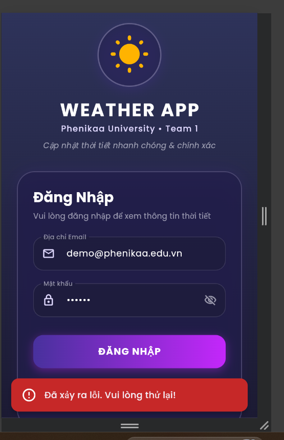
  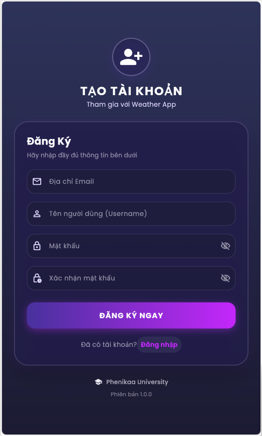
</p>

### Bảng màu chủ đạo (Theme Sáng & Tối)
| Tên | Giao diện | Hex | Dùng cho |
|-----|-----------|-----|---------|
| Deep Purple | Dark | `#1F1D47` / `#2E335A` | Nền màn hình Đăng Nhập & Chế độ tối |
| Vivid Purple | Dark | `#48319D` / `#C427FB` | Nút bấm, Gradient nổi bật |
| Soft Blue | Light | `#E0E5FF` / `#F3F5FF` | Nền màn hình chính chế độ sáng |
| Glass White | Light/Dark| `rgba(255, 255, 255, 0.6)`| Các thẻ Card Glassmorphism |
| Amber/Yellow| Chung | `#FFD700` / `#FFB300` | Icon cảnh báo, nắng mặt trời |
| Sky Blue | Chung | `#83B4FF` | Icon thời tiết, chỉ báo nước/mưa |

### Font chữ
- **Poppins** — Font chính toàn ứng dụng để hiển thị các con số nhiệt độ và text (Google Fonts)
- **Inter / Lora** — Sử dụng trên About screen để thể hiện danh sách thành viên một cách trang trọng.

---

## 📊 Phân công & Commits

| Thành viên | Files chính | Nội dung commit |
|-----------|-------------|----------------|
| **Ngô Thành Long** | `home_screen.dart` | HomeScreen: Weather card, City selector, 5-day forecast, Firestore button |
| **Lê Minh Quang** | `content_screen.dart` | ForecastScreen: Detailed forecast, city comparison table, stat cards |
| **Dương Ngọc Tú** | `about_screen.dart`, `README.md` | AboutScreen, Git management, documentation |
| **Chung (nhóm)** | `main.dart`, `auth_service.dart`, `models/`, `widgets/` | Core framework, Firebase Auth, shared components |

---

## 📋 User Stories

| ID | Câu chuyện |
|----|-----------|
| US-01 | Người dùng **đăng ký** tài khoản mới bằng email, username, mật khẩu |
| US-02 | Người dùng **đăng nhập** bằng email & mật khẩu |
| US-03 | Xem **thời tiết hiện tại** của thành phố đang chọn |
| US-04 | **Chọn thành phố** từ danh sách chip ngang |
| US-05 | Xem **dự báo 5 ngày** kế tiếp |
| US-06 | Xem **chi tiết**: nhiệt độ min/max, xác suất mưa, độ ẩm |
| US-07 | **So sánh thời tiết** giữa các thành phố trong bảng |
| US-08 | Xem **thống kê tổng quan** (nhiệt độ TB, độ ẩm TB, số ngày mưa) |
| US-09 | **Thêm thành phố** vào Firestore NoSQL |
| US-10 | Xem **trang About** với thông tin nhóm & thành viên |
| US-11 | **Đăng xuất** khỏi tài khoản |
| US-12 | Khám phá **thời tiết địa điểm du lịch** (Discover) |

---

## ✅ Checklist hoàn thiện

- [x] Đăng ký / Đăng nhập Firebase Auth
- [x] Màn hình Home (Long) — Weather card, City selector, 5-day forecast
- [x] Màn hình Discover — Agoda-inspired Travel/Weather mockup
- [x] Màn hình Forecast (Quang) — Detailed cards, comparison table, stats
- [x] Màn hình About (Tú) — Team info, personal intro
- [x] Kết nối Firestore NoSQL (addCity)
- [x] Bottom Navigation Bar (4 tab, IndexedStack)
- [x] GroupPhotoHeader & MemberInfoFooter trên tất cả màn hình
- [x] Tìm kiếm chính xác & Gợi ý Autocomplete (chuẩn hóa tiếng Việt NFD/NFC)
- [x] 29 Unit Tests (flutter test)
- [x] Git Repository public
- [ ] Demo YouTube video
- [ ] Báo cáo in chuẩn Phenikaa

---

*Dự án thuộc môn Lập Trình Di Động — Đại học Phenikaa — Học kỳ 2, Năm học 2025-2026*