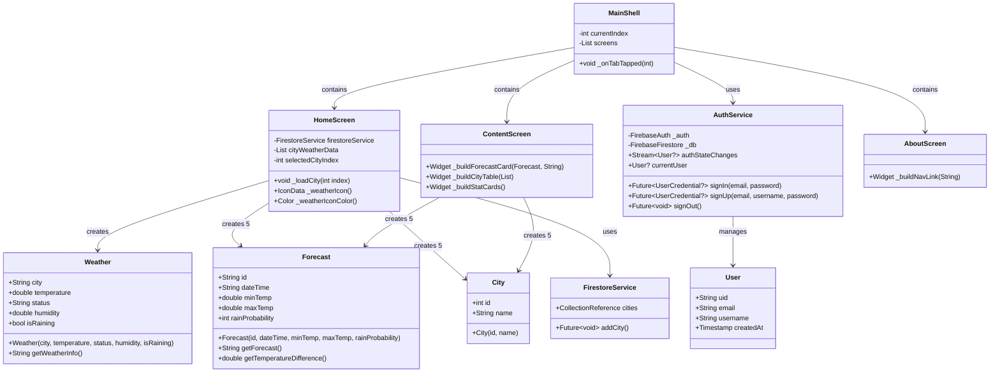
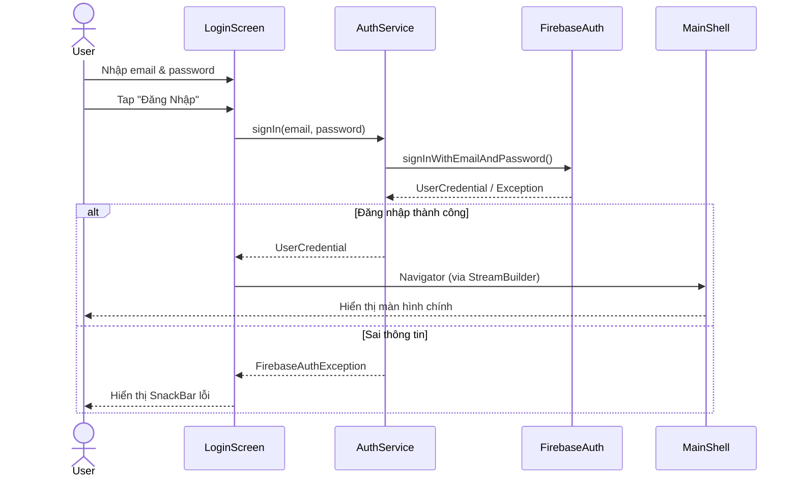
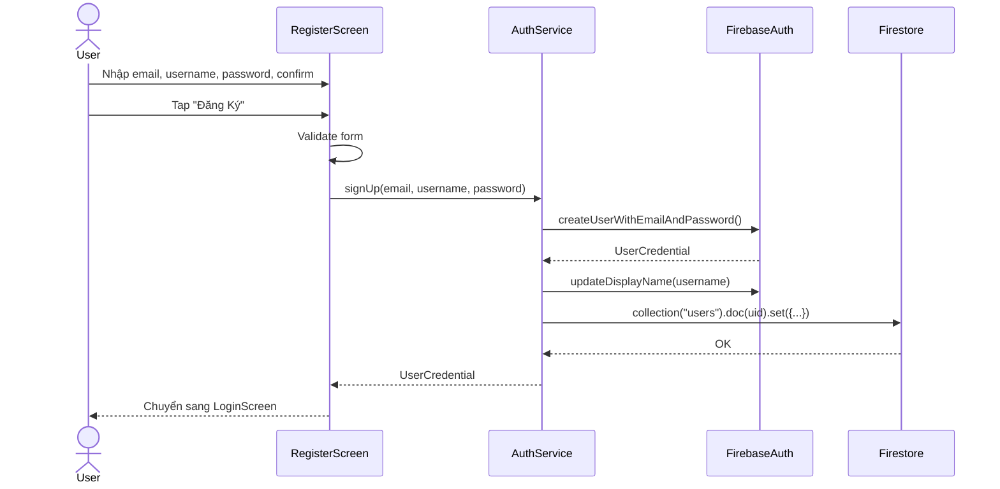
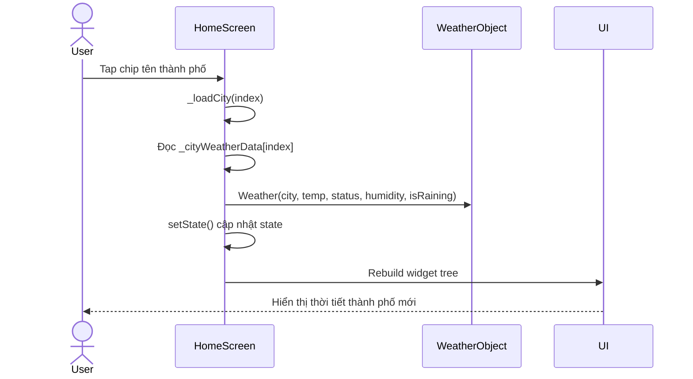
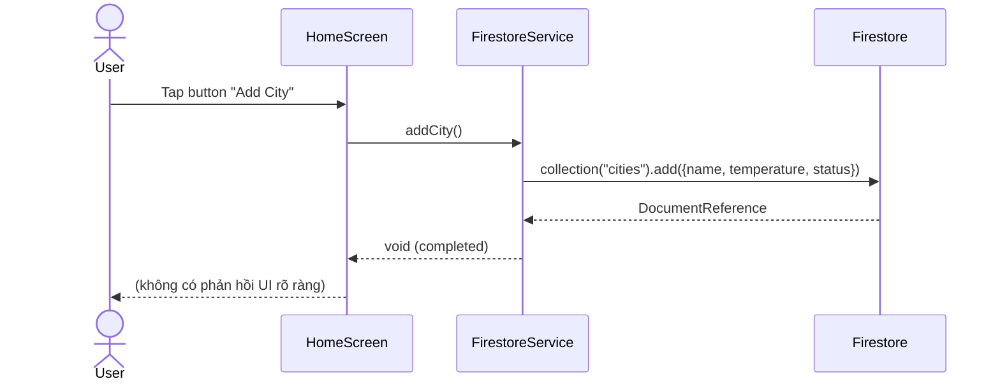
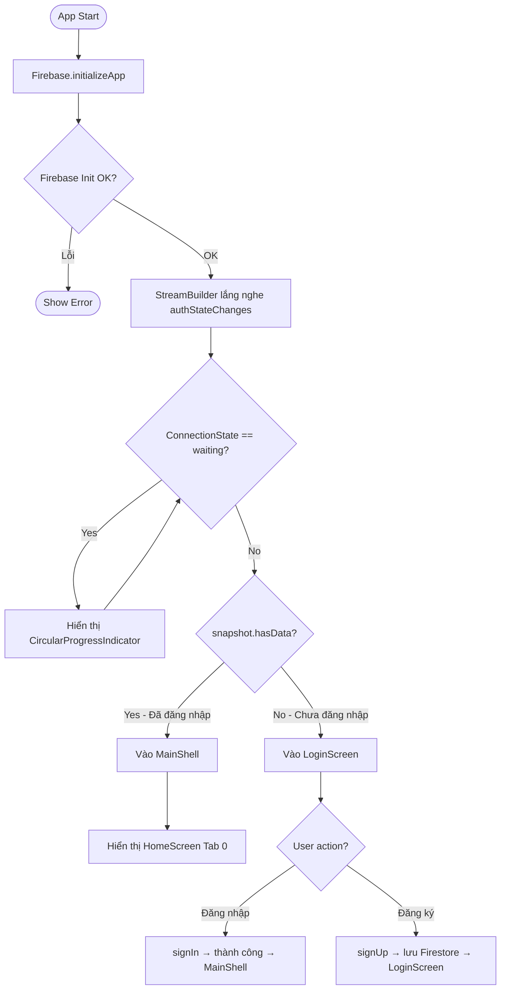
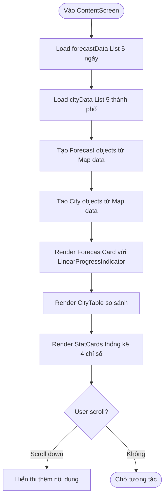

# 📱 PHÂN TÍCH YÊU CẦU BÀI TẬP LỚN — WEATHER APP
## Nhóm 1 | Môn: Lập Trình Di Động | Trường ĐH Phenikaa

---

## 1. PROJECT USER STORIES (Câu chuyện người dùng)

| ID | Vai trò | Hành động | Mục tiêu |
|----|---------|-----------|----------|
| US-01 | Người dùng chưa đăng nhập | Đăng ký tài khoản bằng email, username, mật khẩu | Tạo tài khoản để sử dụng app |
| US-02 | Người dùng chưa đăng nhập | Đăng nhập bằng email & mật khẩu | Truy cập vào tính năng xem thời tiết |
| US-03 | Người dùng đã đăng nhập | Xem thời tiết hiện tại của thành phố đang chọn | Biết nhiệt độ, trạng thái, độ ẩm |
| US-04 | Người dùng đã đăng nhập | Chọn thành phố từ danh sách có sẵn | Xem thời tiết của nhiều địa điểm khác nhau |
| US-05 | Người dùng đã đăng nhập | Xem dự báo thời tiết 5 ngày tới | Lên kế hoạch cho các hoạt động trong tuần |
| US-06 | Người dùng đã đăng nhập | Xem chi tiết: nhiệt độ min/max, xác suất mưa, chênh lệch nhiệt độ | Hiểu rõ hơn về điều kiện thời tiết |
| US-07 | Người dùng đã đăng nhập | So sánh thời tiết giữa các thành phố | Chọn địa điểm phù hợp để di chuyển |
| US-08 | Người dùng đã đăng nhập | Xem thống kê tổng quan (nhiệt độ TB, độ ẩm TB...) | Nắm bắt xu hướng thời tiết tuần |
| US-09 | Người dùng đã đăng nhập | Thêm thành phố vào Firestore | Lưu trữ và đồng bộ dữ liệu thành phố |
| US-10 | Người dùng đã đăng nhập | Xem trang About với thông tin nhóm/thành viên | Biết thêm về nhóm phát triển |
| US-11 | Người dùng đã đăng nhập | Đăng xuất khỏi tài khoản | Bảo mật tài khoản khi không dùng |

---

## 2. PHÂN TÍCH YÊU CẦU, ĐỐI TƯỢNG & PHƯƠNG THỨC

### 2.1 Đối tượng (Objects / Classes)

| Class | Mô tả | Thuộc tính | Phương thức |
|-------|-------|-----------|-------------|
| `User` | Người dùng hệ thống (Firebase Auth) | uid, email, username, createdAt | – |
| `Weather` | Dữ liệu thời tiết hiện tại | city, temperature, status, humidity, isRaining | `getWeatherInfo()` |
| `Forecast` | Dự báo thời tiết một ngày | id, dateTime, minTemp, maxTemp, rainProbability | `getForecast()`, `getTemperatureDifference()` |
| `City` | Thành phố | id, name | – |
| `AuthService` | Xử lý xác thực Firebase | _auth, _db | `signIn()`, `signUp()`, `signOut()`, `authStateChanges` |
| `FirestoreService` | Kết nối Firestore NoSQL | cities (collection) | `addCity()` |

### 2.2 Mối quan hệ đối tượng

```
User ──(uses)──► AuthService ──(communicates)──► Firebase Auth
                                                 Firebase Firestore
HomeScreen ──(creates)──► Weather (1 object)
HomeScreen ──(creates)──► Forecast (5 objects - danh sách)
HomeScreen ──(creates)──► City (5 objects - danh sách)
HomeScreen ──(uses)──► FirestoreService ──► Firestore Collection "cities"
ContentScreen ──(creates)──► Forecast (5 objects)
ContentScreen ──(creates)──► City (5 objects)
```

### 2.3 Phương thức hoạt động chính

| Luồng | Mô tả |
|-------|-------|
| **Auth Flow** | App khởi động → Firebase kiểm tra session → Có user: vào MainShell / Không có: vào LoginScreen |
| **Login Flow** | Nhập email+pass → `AuthService.signIn()` → Firebase verify → Redirect MainShell |
| **Register Flow** | Nhập email+username+pass → `AuthService.signUp()` → Tạo Auth user → Lưu Firestore "users" |
| **City Select** | Tap chip thành phố → `_loadCity(index)` → `setState()` cập nhật Weather object → Rebuild UI |
| **Add City** | Tap "Add City" → `FirestoreService.addCity()` → Ghi document vào Firestore "cities" |
| **Logout Flow** | Tap logout → Confirm dialog → `AuthService.signOut()` → StreamBuilder rebuild → LoginScreen |

---

## 3. SƠ ĐỒ CẤU TRÚC (CLASS DIAGRAM)



---

## 4. SƠ ĐỒ THUẬT TOÁN

### 4.1 Sequence Diagram — Đăng Nhập (Login)



### 4.2 Sequence Diagram — Đăng Ký (Register)



### 4.3 Sequence Diagram — Chọn Thành Phố



### 4.4 Sequence Diagram — Thêm Thành Phố vào Firestore



### 4.5 Activity Diagram — Luồng Khởi Động App



### 4.6 Activity Diagram — Luồng Xem Dự Báo



---

## 5. THIẾT KẾ MÀN HÌNH / MOCKUP

### 5.1 Cấu trúc màn hình

```
┌─────────────────────────────────┐
│  AppBar: ☀ [Title]    [Logout]  │
├─────────────────────────────────┤
│  GroupPhotoHeader (Ảnh nhóm)    │
├─────────────────────────────────┤
│                                 │
│   [Nội dung chính - scrollable] │
│                                 │
├─────────────────────────────────┤
│  MemberInfoFooter (Thông tin)   │
├─────────────────────────────────┤
│ [🏠 Home] [📊 Forecast] [👤 More]│
└─────────────────────────────────┘
```

### 5.2 Màn hình Login

```
┌──────────────────────────┐
│   ☀️ Weather App          │
│   "Chào mừng trở lại"   │
│                          │
│  [📧 Email field       ] │
│  [🔒 Password field    ] │
│                          │
│  [    ĐĂNG NHẬP        ] │
│                          │
│  Chưa có tài khoản?     │
│  → Đăng ký ngay         │
└──────────────────────────┘
```

### 5.3 Màn hình Home (Tab 1 - Long)

```
┌──────────────────────────┐
│ [Ảnh nhóm Header]        │
├──────────────────────────┤
│ Gradient Card:           │
│   Hà Nội      ☀️         │
│   32°C                   │
│   Sunny, Humidity: 70%   │
├──────────────────────────┤
│ Chọn Thành Phố:          │
│ [Hà Nội] [Đà Nẵng] ...  │
├──────────────────────────┤
│ Dự Báo 5 Ngày:           │
│ [T2] [T3] [T4] [T5] [T6]│
├──────────────────────────┤
│ Chi Tiết Thời Tiết       │
│ 📍 city: Hà Nội          │
│ 🌡 temp: 32.5°C           │
├──────────────────────────┤
│ [+ Add City to Firestore]│
└──────────────────────────┘
```

### 5.4 Màn hình Forecast (Tab 2 - Quang)

```
┌──────────────────────────┐
│ Dự Báo Chi Tiết 5 Ngày  │
│ ┌─────────────────────┐  │
│ │ Thứ Hai  25°-32°C   │  │
│ │ Nắng đẹp, ít mây   │  │
│ │ 💧 10%  ████░░░░░░  │  │
│ └─────────────────────┘  │
│ [Repeat x5]              │
├──────────────────────────┤
│ So Sánh Thành Phố        │
│ ┌──────┬──────┬───────┐  │
│ │ Tên  │ Nhiệt│ TT    │  │
│ ├──────┼──────┼───────┤  │
│ │ HN   │32.5° │☀Sunny │  │
│ └──────┴──────┴───────┘  │
├──────────────────────────┤
│ Thống Kê:                │
│ [31.5°C] [76%]           │
│ [2/5 mưa] [7.0°C]        │
└──────────────────────────┘
```

---

## 6. THỰC HIỆN LAYOUT & IMPLEMENTATION

### 6.1 Stack công nghệ

| Thành phần | Công nghệ |
|-----------|-----------|
| Framework | Flutter (Dart) |
| Auth | Firebase Authentication |
| Database | Cloud Firestore (NoSQL) |
| Font | Google Fonts (Poppins, Inter, Lora) |
| State | StatefulWidget + setState |
| Navigation | BottomNavigationBar + IndexedStack |

### 6.2 Cấu trúc thư mục

```
lib/
├── main.dart              # Entry point, MyApp, MainShell
├── firebase_options.dart  # Firebase config
├── models/
│   ├── weather.dart       # Class Weather
│   ├── forecast.dart      # Class Forecast
│   └── city.dart          # Class City
├── screens/
│   ├── login_screen.dart   # US-02
│   ├── register_screen.dart # US-01
│   ├── home_screen.dart    # US-03,04,05,06,09
│   ├── content_screen.dart # US-07,08
│   └── about_screen.dart   # US-10
├── service/
│   ├── auth_service.dart   # Firebase Auth wrapper
│   └── firestore_service.dart # Firestore CRUD
└── widgets/
    ├── bottom_nav_bar.dart # Navigation bar
    ├── app_drawer.dart     # Side drawer
    └── shared_widgets.dart # GroupPhotoHeader, MemberInfoFooter
```

### 6.3 Kết nối CSDL Firestore

```
Firestore Collections:
├── users/
│   └── {uid}:
│       ├── uid: String
│       ├── email: String
│       ├── username: String
│       └── createdAt: Timestamp
└── cities/
    └── {auto-id}:
        ├── name: String
        ├── temperature: Number
        └── status: String
```

---

## 7. KIỂM THỬ (UNIT TEST)

### 7.1 Test Cases — Model

| ID | Test | Input | Expected |
|----|------|-------|----------|
| T-01 | Weather.getWeatherInfo() | city="HN", temp=32.5, status="Sunny", hum=70, rain=false | "City: HN, Temp: 32.5°C, Status: Sunny, Humidity: 70.0%, Raining: No" |
| T-02 | Forecast.getTemperatureDifference() | minTemp=24.0, maxTemp=32.0 | 8.0 |
| T-03 | Forecast.getForecast() | dateTime="Thứ 2", min=24, max=32 | "Thứ 2: 24.0°C – 32.0°C" |
| T-04 | City creation | id=1, name="Hà Nội" | city.name == "Hà Nội" |

### 7.2 Test Cases — AuthService

| ID | Test | Điều kiện | Expected |
|----|------|-----------|----------|
| T-05 | signIn() thành công | Email/pass đúng | UserCredential != null |
| T-06 | signIn() sai pass | Pass sai | Throw FirebaseAuthException |
| T-07 | signUp() mới | Email chưa dùng | UserCredential + Firestore doc created |
| T-08 | signOut() | Đang đăng nhập | currentUser == null |

### 7.3 Test Performance
- Target: **60 FPS** trên Android/iOS
- Dùng `IndexedStack` để giữ state khi chuyển tab → tránh rebuild
- Dùng `AnimatedContainer` với duration 220ms cho city chip

---

## 8. GIT & ĐÓNG GÓP

### 8.1 Phân công thành viên

| Thành viên | Màn hình | Commit |
|-----------|---------|--------|
| **Long** | `home_screen.dart` | HomeScreen, Weather Card, City Selector, Forecast |
| **Quang** | `content_screen.dart` | Forecast Details, City Table, Stat Cards |
| **Tú** | `about_screen.dart`, `README.md`, Git management | About Page, Docs |
| **Chung** | `main.dart`, `auth_service.dart`, `models/`, `widgets/` | Core framework, Auth |

### 8.2 Nhánh Git đề xuất

```
main
├── feature/long-home-screen
├── feature/quang-forecast-screen
├── feature/tu-about-screen
└── feature/auth-firebase
```

---

## 9. CHECKLIST BÀI TẬP LỚN

| Hạng mục | Trạng thái | Điểm |
|---------|-----------|------|
| ✅ User Stories (≥10 câu chuyện) | **Hoàn thành** | 1đ |
| ✅ Phân tích đối tượng & phương thức | **Hoàn thành** | 1đ |
| ✅ Class Diagram | **Hoàn thành** | 1đ |
| ✅ Sequence Diagrams (4 sơ đồ) | **Hoàn thành** | |
| ✅ Activity Diagrams (2 sơ đồ) | **Hoàn thành** | |
| 🔲 Figma Mockup / Wireframe | **Cần bổ sung** | 1đ |
| ✅ Layout mẫu (Flutter screens) | **Hoàn thành** | 1đ |
| ✅ Implementation User Stories | **Hoàn thành** | 1đ |
| ✅ Kết nối Firestore NoSQL | **Hoàn thành** | 1đ |
| 🔲 Unit Test code | **Cần bổ sung** | 1đ |
| 🔲 Deploy & Test 60fps | **Cần kiểm tra** | |
| 🔲 Báo cáo mẫu Phenikaa | **Cần in** | |
| ✅ Git Repo + Commits | **Hoàn thành** | 1đ |
| 🔲 Link Demo YouTube | **Cần quay video** | |

